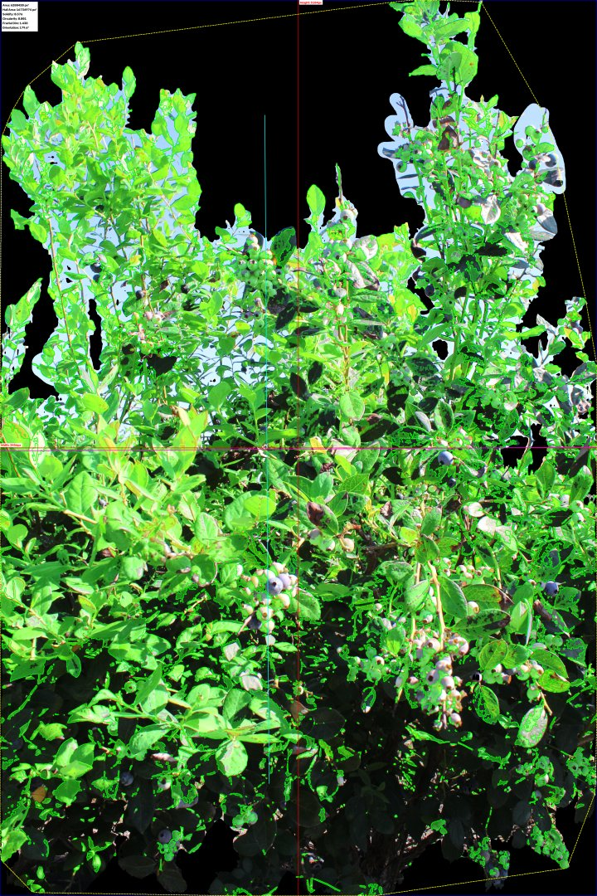
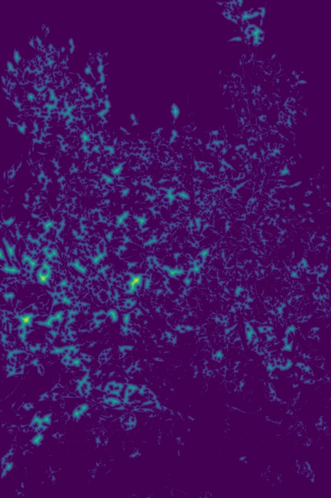
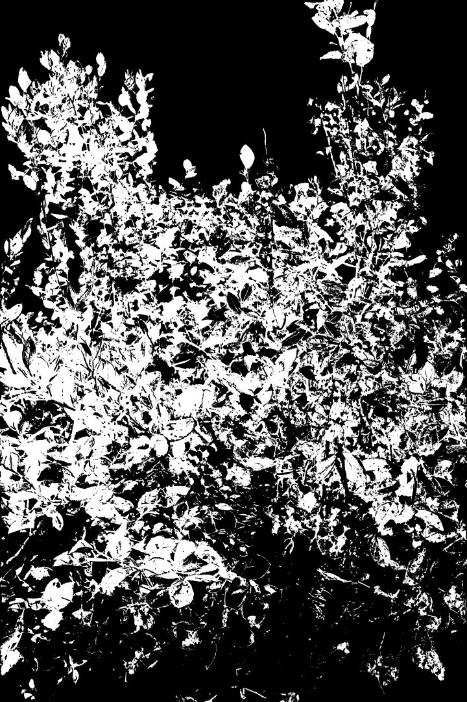
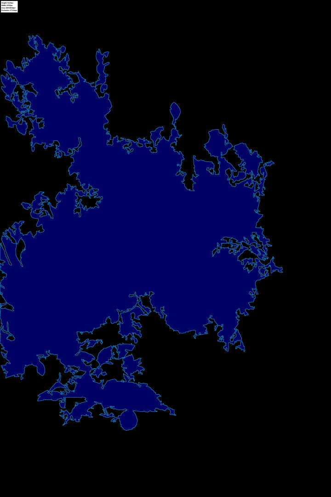

# Image-Based Estimation of Blueberry Yield Incorporating External Validation and Canopy Architecture Under Field Conditions

Official repository accompanying the research publication:

> **Image-Based Estimation of Blueberry Yield Incorporating External Validation and Canopy Architecture Under Field Conditions**  
> **Repository Maintainer**: *Raghav Rathi*  
> *Paul Adunola, Tyler J. Schultz, Bruno Leme, Amman Mohit Minz, Raghav Rathi, Luis Felipe Ventorim Ferrão, Patricio Muñoz*  
> **Blueberry Breeding and Genomics Lab, Horticultural Sciences Department, University of Florida**

---

## End-to-End Workflow Diagram

The integrated phenotyping workflow illustrates raw image capture, object detection, SAM3 canopy segmentation, architectural feature extraction, binary masking, and precision mask-filtered detection:


### Panel Breakdown & Workflow Pipeline:

* **(a) Raw Field Input Image**:  
  Original high-resolution RGB image of the target blueberry plant captured under natural field conditions.

* **(b) Full-Scene Object Detection**:  
  Initial multi-class detection (immature berries, mature berries, flowers) using YOLOv8x/YOLOv11x with SAHI sliced inference across the entire raw frame.

* **(c) SAM3 Zero-Shot Canopy Segmentation**:  
  Target plant segmentation generated using SAM3 to isolate the target bush from neighboring rows, weeds, and ground cover.

* **(d) Canopy Architecture & Spatial Feature Extraction**:  
  Derived geometrical metrics including Convex Hull polygon, minimum bounding box dimensions (Height, Width), Canopy Area (px²), Surface Area, Circularity, and principal orientation axes.

* **(e) Isolated Canopy Binary Mask**:  
  Cleaned binary foliage mask representing the leaf density and canopy silhouette used to compute canopy occlusion factors.

* **(f) Mask-Filtered Precision Detections**:  
  Final fruit detections restricted strictly within the target canopy boundary. Filtering out background fruit from adjacent rows eliminates false positives and maximizes single-plant yield phenotyping precision.

---

### Canopy Architecture & Feature Extraction (Module 3)

Extracting spatial canopy geometry, Euclidean distance transforms, HSV color space vegetation masks, and convex hull silhouettes to model canopy occlusion (which ranges from 51% to 95% across genotypes):

| Canopy Metrics Overlay | Distance Transform Map | HSV Vegetation Mask | Silhouette Convex Hull |
| :---: | :---: | :---: | :---: |
|  |  |  |  |
| *Canopy Area & Solidity* | *Euclidean Distance Map* | *Color-Threshold Foliage* | *Convex Hull & Bounding Box* |

---

## Abstract Summary & Key Results

Quantifying blueberry fruit yield and maturity is critical for evaluating yield potential in breeding trials, but manual measurement remains slow, labor-intensive, and costly. Object detection networks offer high-throughput automated phenotyping, yet image-based counts systematically underestimate hand-harvested yield due to canopy occlusion.

Key findings from our study across 32 southern highbush blueberry genotypes:
- **Object Detection Performance**: YOLOv8x achieved an **mAP50 of 0.82** and an **mAP50–95 of 0.66**.
- **External Validation**: Produced **F1-scores ranging from 0.74 to 0.91** across berry maturity stages.
- **Canopy Occlusion**: Fruit occlusion varied between **51% and 95%** depending on cultivar canopy architecture.
- **Yield Model Improvement**: Incorporating image-derived canopy architecture (area, height, width, solidity, distance transform) into Ridge regression improved yield estimation R² from **0.57 to 0.79**.

---

## Repository Directory Layout

```text
berry-vision/
├── README.md                           # Documentation & execution guide
├── requirements.txt                    # Project dependencies
├── data/                               # Workflow assets & sample benchmark images
│   ├── grid.png                        # Integrated 6-panel workflow diagram (Panels a-f)
│   └── sample_images/                  # Benchmark field images (sample_01 to sample_08)
├── 01_detection_training/              # Module 1: Blueberry Detection & Model Training
│   ├── download_flowerberry_dataset.py # Roboflow download, SAHI slicing & COCO-to-YOLO conversion
│   ├── train.py                        # Multi-class YOLO training script
│   └── outputs/                        # Detection CSVs & sample detection images
├── 02_sam3_segmentation/               # Module 2: SAM3 Zero-Shot Canopy Mask Generation
│   ├── generate_sam3_masks.py          # SAM3 mask generation & translucent overlay script
│   ├── diagnostics/                    # Segmentation reports (CSV / JSON)
│   └── sample_overlays/                # Translucent SAM3 canopy mask overlays
└── 03_plant_architecture/              # Module 3: Canopy Architecture & Size Extraction
    ├── extract_plant_architecture.py   # Main CLI entrypoint for canopy & size feature extraction
    ├── utils/                          # Helper utilities:
    │   ├── inference.py                # SAHI sliced prediction loader
    │   ├── canopy_metrics.py           # Canopy area, HSV, distance transform, & hull geometry
    │   ├── berry_sizing.py             # Bounding box sizing calculation
    │   └── visualization.py            # PyTorch GPU mask blending & visualization maps
    ├── leafanalysis/                   # Core BlueberryAnalyzer package
    └── outputs/                        # CSV reports & sample metric visualization maps:
        ├── canopy_metric_visualization/
        ├── distance_transform/
        ├── final_canopy_mask/
        ├── hsv_mask/
        └── silhouette_analysis/
```

---

## Installation & Quickstart

### 1. Clone the Repository
```bash
git clone https://github.com/SFP-team/Blueberry_Detection.git
cd Blueberry_Detection
```

### 2. Create Virtual Environment
```bash
python3 -m venv venv
source venv/bin/activate
```

### 3. Install Requirements
```bash
pip install -r requirements.txt
```

---

## Module Execution Tutorials

### Module 1: Blueberry Detection & Training

#### Download and Slice Dataset into YOLO Format
```bash
python 01_detection_training/download_flowerberry_dataset.py --roboflow_version 2
```

#### Train Multi-Class YOLO Model
```bash
python 01_detection_training/train.py \
    --train_type flowerberries \
    --dataset_path ./datasets/flowerberry/fb-2/data.yaml \
    --model yolo11x.pt \
    --epochs 500 \
    --imgsz 400 \
    --batch 8
```

---

### Module 2: SAM3 Canopy Segmentation & Overlays

Generate translucent SAM3 canopy overlays over raw field images:
```bash
python 02_sam3_segmentation/generate_sam3_masks.py \
    --input_dir ./data/sample_images \
    --output_dir ./02_sam3_segmentation/sample_overlays \
    --alpha 0.4
```

---

### Module 3: Canopy Architecture Metrics & Berry Size Distribution

Extract spatial canopy features (area, height, width, solidity, distance transform), HSV vegetation masks, silhouette convex hulls, and individual berry size distributions (`berries_sizes.csv`):
```bash
python 03_plant_architecture/extract_plant_architecture.py \
    --flowerberry_model_path ./yolo11x.pt \
    --input_dir ./data/sample_images \
    --output_dir ./03_plant_architecture/outputs \
    --berries_detection \
    --berries_sizes \
    --plant_structure
```

---

## Citation

If you use this repository, dataset, or methodology in your research, please cite our paper:

```bibtex
@article{adunola2026blueberry,
  title={Image-Based Estimation of Blueberry Yield Incorporating External Validation and Canopy Architecture Under Field Conditions},
  author={Adunola, Paul and Schultz, Tyler J. and Leme, Bruno and Minz, Amman Mohit and Rathi, Raghav and Ferr{\~a}o, Luis Felipe Ventorim and Mu{\~n}oz, Patricio},
  journal={Horticultural Sciences Department, University of Florida},
  year={2026}
}
```